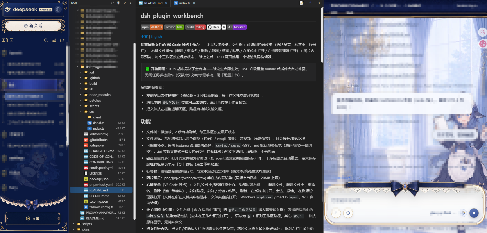

[中文](./README.md) | **English**

# dsh-plugin-workbench


**A VS Code-style workbench that edits files directly** — not a read-only preview: file tree + editable code preview
(syntax highlighting, tabs, line-number gutter) + right-click file operations (new / rename / delete / copy / cut /
paste / open in system / reveal in file explorer) + inline image preview, with state saved independently per workspace.
Once installed, the DSH web GUI becomes a lightweight code editor.

> ✅ **Works out of the box**: since 0.0.9 the layout patch is fully automated — it takes effect right after install and
> restart; if a DSH upgrade overwrites the bundle, the plugin patches it back automatically, with no manual steps
> required (manual action is only needed if the anchors break, see the "Configuration" section).
> Since 0.0.15 both build flavors — the npm build and the DSH Desktop bundled build — are detected automatically, so
> **DSH Desktop works out of the box** too.

What you'll see after installing:

- A **file tree sidebar** on the left (lazy loading + 2-second auto-refresh, expansion state kept per workspace);
- `@relative-path` mentions in messages turn into **clickable links** that open a preview in the workbench;
- **Drag files from the left panel into the chat area** and the path is inserted into the input box automatically.

## Screenshot



> Real Web GUI screenshot.

## Features

- File tree: lazy loading, 2-second auto-refresh, expansion state kept per workspace
- File icons: colored badges for common code formats / emoji for images, audio & video, archives, etc.; expanded and
  collapsed directories are visually distinguished
- Editable preview: transparent textarea layered over syntax highlighting, save with `Ctrl+S`/`Cmd+S`;
  Markdown renders a preview by default (one-click switch between source and rendered view); prose formats like
  .txt and very large code files automatically fall back to plain-text editing — fast to load, no UI jank
- **Disk change sync**: when an open file is modified externally (e.g. saved by an agent or another editor),
  clean tabs reload automatically, while tabs with unsaved edits show a "⟳" badge (click to reload)
- **Line-number gutter**: logical line numbers along the editor's left edge, locked in alignment with text scrolling
  (works in both plain-text and highlighted modes)
- **Image preview**: png/jpg/gif/webp/avif/svg and more render inline directly (same-origin byte route, 20MB limit)
- **Context menu** (VS Code style): right-click on files, folders, **any blank space in the panel, or the panel
  header** — new file, new folder, rename, delete (recursive, with confirmation), copy path, copy / cut / paste,
  refresh, open in system, select all, undo,
  reveal in file explorer (a file is revealed selected in its folder, a folder opens directly;
  Windows `explorer` / macOS `open`, automatically translated under WSL)
- **Reference files with @ in messages**: the file context-menu item "Reference with @" inserts
  `@workspace-relative-path` into the chat input box; once sent, `@relative-path` mentions in the message render as
  hyperlinks (click to open a preview in the workbench). The syntax is `@` + a workspace-relative path; any other
  `@text` is always displayed as-is and has no special meaning
- **Drag files into the conversation**: drag a file or a multi-selection from the left panel anywhere into the chat
  area and the path text is inserted at the input box cursor; dropping onto a directory row in the left panel is
  still a move operation
- **Click anywhere to deselect**: clicking anywhere outside the tree (conversation / other panels / left panel
  header) clears the selection
- **Copy / cut / paste**: Ctrl/Cmd+C/X/V (or the context menu), with cross-workspace paste support;
  when the target already contains an item with the same name you are asked whether to overwrite, just like the
  system file manager; the clipboard is cleared automatically after a successful cut (move)
- **Batch operations**: Ctrl/Cmd+click and Ctrl+A multi-select, delete selected items in bulk via the context menu or
  the Delete key, drag the whole group to move it
- **Undoable operations**: the "↩" button at the top right or Ctrl+Z undoes the most recent operation (kept per
  workspace, up to 30 entries): copy (removes the copy), cut/drag move (moves back to the original place), rename,
  create, delete; deletion is an undoable delete (files are moved instantly into a hidden `.dsh-trash`, no bytes
  copied)
- **Reveal in file explorer**: a context-menu item (equivalent to VS Code's Reveal in File Explorer) that locates the
  file/folder in the system file manager (Windows Explorer, macOS Finder, etc.), executed via the `reveal` endpoint of
  the loopback RPC
- Word wrap: one-click soft-wrap toggle in the tab bar (wrapping at the display layer only, file content untouched) or
  horizontal scrolling for long lines; the preference persists
- Tabs: multiple files, drag to reorder, collapse/pop out; one-click light/dark theme switching
- Syntax highlighting: highlight.js (JS/TS, Python, JSON, HTML, CSS, Shell, and more;
  Markdown renders a preview by default, switchable to source)
- Markdown rendering: markdown-it (raw HTML is always escaped, never executed); relative-path images are displayed
  inline via the same-origin route `/dsh-plugin-files/raw/<path>`
- Disk changes: the host watches open files with `fs.watch` (watching the parent directory, surviving atomic renames);
  changes are pushed over SSE at `/dsh-plugin-files/events`, and clean tabs sync automatically

## Configuration

No environment variables or config files needed; the layout patch is fully automated (the plugin automatically detects
and re-runs `scripts/patch-layout.mjs` at startup — idempotent, non-blocking; since 0.0.15 both build flavors of the
same version are detected automatically — the npm build and the DSH Desktop bundled build; anchors are byte-coupled to
the compiled output, so a DSH upgrade that breaks them requires anchor updates):
- **Behavior preferences** (word wrap, light/dark theme, tab layout, file tree expansion state) persist per workspace
  and need no manual configuration;
- **File operation channel**: via the loopback RPC `/dsh-plugin-files`; write operations are executed explicitly under
  `danger-full-access`, with no external configuration options.

## Installation

> Layout-patch anchors are byte-coupled to the DSH compiled output; a DSH upgrade that breaks them requires anchor
> updates. Since 0.0.15 both build flavors (npm / DSH Desktop) are detected automatically and the patch re-applies at
> startup (see the "Configuration" section for details).

```powershell
# npm (recommended)
dsh plugin --profile web add dsh-plugin-workbench
# or GitHub
dsh plugin --profile web add github:Pasumao/dsh-plugin-workbench
```

Install from source (local development / debugging):

```bash
git clone https://github.com/Pasumao/dsh-plugin-workbench.git
cd dsh-plugin-workbench
pnpm install
pnpm run build     # produces lib/index.js and lib/client.js
# mount into the profile via link:
```

After installing, apply the layout patch and restart:

```powershell
node node_modules/dsh-plugin-workbench/scripts/patch-layout.mjs
# restart dsh web
```

> Since 0.0.9 the plugin automatically detects and re-applies the layout patch at startup — no need to run it manually
> after DSH upgrades; run the command above manually only if the automatic re-patching fails (broken anchors).

## Development

```powershell
pnpm install
pnpm run build       # produces lib/index.js (host) and lib/client.js (browser)
pnpm run typecheck
```

## Uninstall

```powershell
dsh plugin --profile web remove dsh-plugin-workbench
# and restore the layout bundle (patches/layout.backup/client.js.orig → dsh-client-ui-layout/lib/client.js)
```

## Notes

- The `/dsh-plugin-files` RPC channel is loopback-only; write operations are executed explicitly under
  `danger-full-access`; the context menu's create/rename/delete go through the same channel too (loopback trust,
  same as saving in the editor)
- Image preview goes through the same-origin route `/dsh-plugin-files/raw/<path>`: it only responds to image
  extensions, resolves the path via `ctx.fs.resolve → stat` first (sandbox-consistent path resolution) before reading
  bytes, with a 20MB limit
- DSH upgrades overwrite the layout bundle; since 0.0.9 the plugin detects and re-applies the patch automatically at
  startup, so there is no need to re-run it manually; if the anchors break, `scripts/patch-layout.mjs` must be updated
  (since 0.0.15 the anchor table carries two build variants auto-detected per target — npm and desktop-ci, the latter
  stored in `scripts/layout-anchors.desktop-ci.json`)
- This repository does not include DSH build artifacts

## Contributing

See [CONTRIBUTING](./CONTRIBUTING.md) and [CODE_OF_CONDUCT](./CODE_OF_CONDUCT.md); the changelog is in
[CHANGELOG](./CHANGELOG.md).

## Compatibility

- Tested on DSH `0.1.2-rc.1` (since 0.0.16 the layout patch anchors are adapted to that
  version: the detailsCol border style changed from `1px/--dsw-alias-border-l2` to
  `.5px/--dsw-alias-border-l3`, and the DetailsColumn children gained a `SessionProvider`
  wrapper); for 0.1.1-rc.2 and earlier, use the 0.0.15 anchor table.
- Since 0.0.9 the plugin re-applies the layout patch automatically at startup, so DSH
  upgrades normally need no manual action; on anchor mismatch the startup log shows
  `ui-layout patch exited 1` — upgrading this plugin fixes it.
## Related plugins

This plugin is part of **Pasumao's dsh plugin ecosystem**; the published plugins in the same series can be used
alongside it:

| Plugin (npm) | GitHub | Description |
|---|---|---|
| [dsh-notify](https://www.npmjs.com/package/dsh-notify) | [GitHub repo](https://github.com/Pasumao/dsh-plugin-notify) | Native Windows notifications + system tray |
| [dsh-plugin-choice-refresh](https://www.npmjs.com/package/dsh-plugin-choice-refresh) | [GitHub repo](https://github.com/Pasumao/dsh-plugin-choice-refresh) | Choice enhancements: regenerate options / more options |
| [dsh-plugin-dev-kb](https://www.npmjs.com/package/dsh-plugin-dev-kb) | [GitHub repo](https://github.com/Pasumao/dsh-plugin-dev-kb) | Plugin development knowledge base (full mirror of the official docs + skill) |
| [dsh-plugin-image-tools](https://www.npmjs.com/package/dsh-plugin-image-tools) | [GitHub repo](https://github.com/Pasumao/dsh-plugin-image-tools) | Image choice cards + inline images in replies + image intake for text-only models |
| [dsh-plugin-table-zoom](https://www.npmjs.com/package/dsh-plugin-table-zoom) | [GitHub repo](https://github.com/Pasumao/dsh-plugin-table-zoom) | Floating window for long chat tables + one-click Markdown copy |
| [dsh-plugin-windows-guard](https://www.npmjs.com/package/dsh-plugin-windows-guard) | [GitHub repo](https://github.com/Pasumao/dsh-plugin-windows-guard) | Windows environment safeguards: guideline skills + mojibake detection / dangerous-write interception / encoding diagnosis & repair |

> For the remaining plugins in the series, see [Pasumao · dsh plugins](https://github.com/Pasumao); if you find them useful, a ⭐ on GitHub is always welcome.

## AI generation statement

Part of the source code and documentation was generated with AI assistance (DeepSeek Harness) and has been
human-reviewed and verified on a live system; permission-related logic has been re-reviewed against the principle of
least privilege.

## License

[MIT](./LICENSE)
